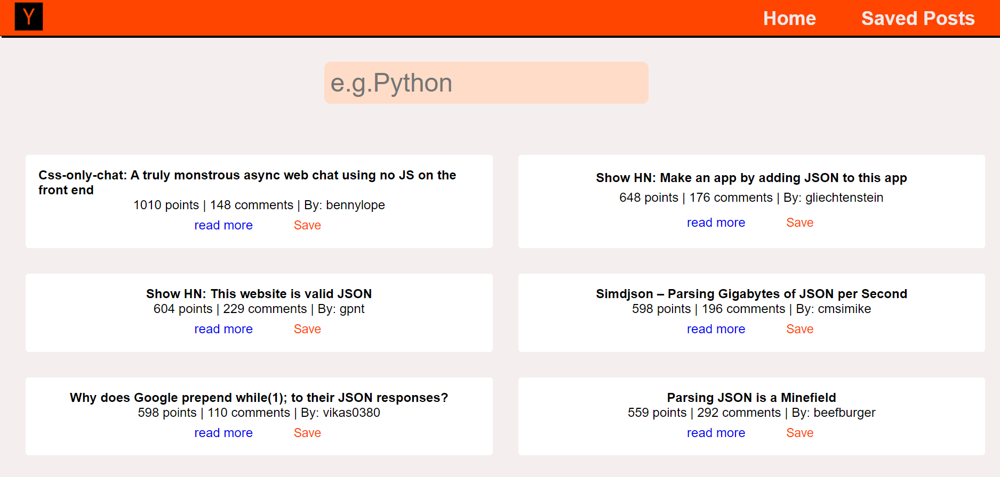
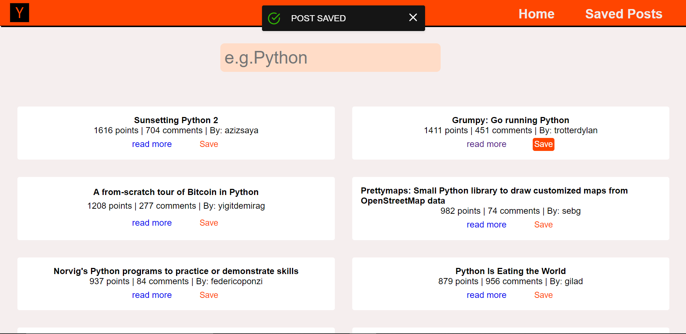
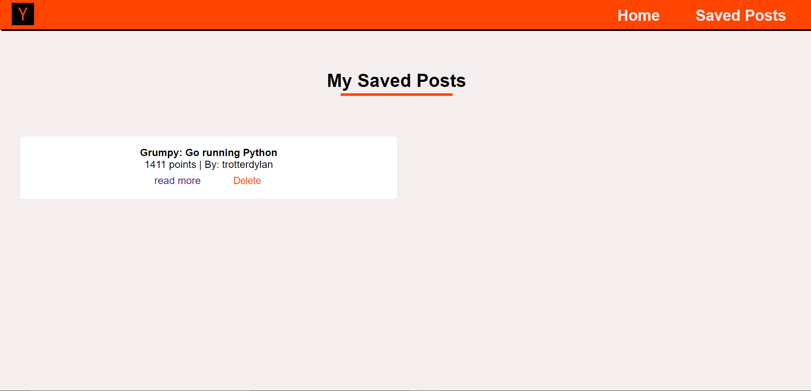

# Hacker News Saver

This is a web app that displays posts from [Hacker News](https://news.ycombinator.com/) and allows users to save their favourite posts into a database.

This project was made using React on the frontend with Spring boot and MySQL.

Run npm install to install the dependencies and then npm start to start the server. Open http://localhost:3000 to view it in the browser.

## Overview

The web page uses the [algolia hacker news API](https://hn.algolia.com/api) to filter out posts based on the user's search. The default search term is python

I used [React Alert](https://www.npmjs.com/package/react-alert) to render the alert notifications.

When the user clicks on the save button on a post, it is saved in the MySQL database and displayed on the saved posts page.

